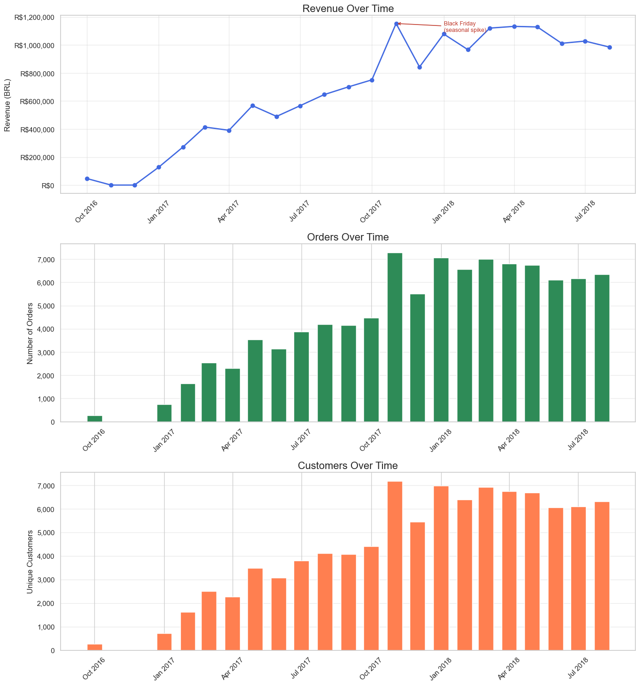
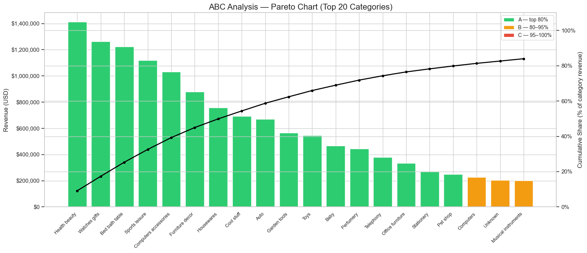
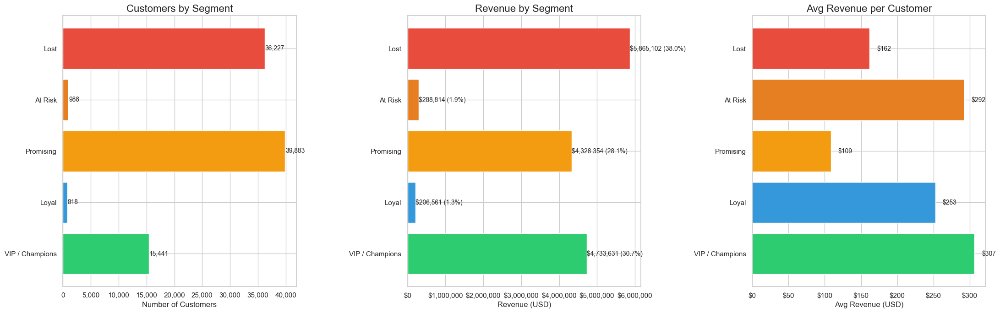
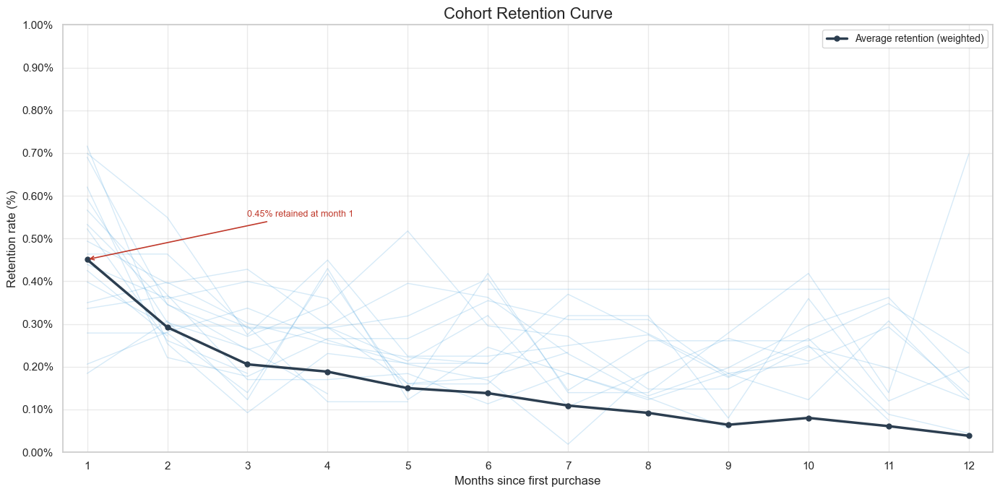

# 🇧🇷 Olist E-commerce: Growth vs. Retention Audit

## 🔎 Project Snapshot

| Metric | Value |
|---|---|
| Total Revenue | $15,422,461 |
| Total Orders | 96,477 |
| Unique Clients | 93,357 |
| Average Order Value | $159.86 |
| Period | Sep 2016 – Oct 2018 |

**Core Finding:** 2018 revenue plateau is structural — not a traffic problem. Root cause is a 0.45% first-month retention rate and $5.86M sitting in the "Lost" segment with no reactivation mechanism.

---

## 📖 The Story: The "Frozen Million"

After 10× growth in 2017, Olist's revenue stalled between **$0.98M–$1.1M/month** throughout 2018. New customer volume remained constant — but revenue didn't grow. This audit proves why: **the platform is replacing churned customers with new ones at a near 1:1 ratio.** Without a retention layer, every growth dollar is spent refilling a leaky bucket.

---

## 📈 Revenue & Customer Dynamics



Revenue, orders, and unique customers move in lockstep — three lines with nearly identical shapes. This is the visual proof that revenue is a pure function of acquisition, not retention. The November 2017 spike is **Black Friday (Dia de Ofertas)** — a seasonal event, not organic growth. The January 2018 correction to ~$830k confirms it.

---

## 📊 ABC / Pareto Analysis



17 of 73 categories generate **80% of revenue (Group A)**. The top 5 alone account for 39%.

| # | Category | Revenue | Type |
|---|---|---|---|
| 1 | Health & Beauty | $1.41M | ✅ Consumable |
| 2 | Watches & Gifts | $1.26M | ❌ One-time |
| 3 | Bed, Bath & Table | $1.22M | ❌ One-time |
| 4 | Sports & Leisure | $1.11M | ✅ Repeat potential |
| 5 | Computers & Accessories | $1.03M | ⚠️ Moderate |

The real insight is not the 80/20 split — that's expected for any marketplace. It's that **roughly half of Group A revenue comes from one-time purchase categories** (furniture, watches, electronics). These inflate AOV but contribute nothing to retention. Shifting acquisition spend toward consumable categories (Health & Beauty, Sports, Pet Shop) is the highest-leverage structural fix available.

---

## 🧠 Customer Segmentation (RFM)



| Segment | Customers | Revenue | Rev. Share | Avg. Order |
|---|---|---|---|---|
| **Lost** | 36,227 | $5,865,102 | **38.0%** | $162 |
| **VIP / Champions** | 15,441 | $4,733,631 | 30.7% | $307 |
| **Promising** | 39,883 | $4,328,354 | 28.1% | $109 |
| **At Risk** | 988 | $288,814 | 1.9% | $292 |
| **Loyal** | 818 | $206,561 | 1.3% | $253 |

**The "Lost" segment is the most important number in this table.** $5.86M generated by customers who bought once and never returned. This is not dead weight — these people know the platform, they converted once, and they can convert again at a fraction of the original CAC.

**The math on reactivation:**
- 5% of Lost reactivated (1,811 customers) × $162 AOV = **+$293k**
- That alone exceeds the entire current Loyal segment revenue ($206k)

**"Loyal" at 0.9% of the base is the real warning signal** — not the churn rate. It means the mechanism that converts a first-time buyer into a repeat buyer is essentially nonexistent.

---

## 🔁 Cohort Retention — The Leaky Bucket



| Month | Weighted Retention |
|---|---|
| 1 | 0.45% |
| 2 | 0.29% |
| 3 | 0.21% |
| 6 | 0.14% |
| 12 | 0.04% |

**Benchmark context:**

| Platform Type | Month-1 Retention |
|---|---|
| Subscription e-commerce | 40–60% |
| General e-commerce | 20–35% |
| Marketplace (Etsy-type) | 8–15% |
| **Olist** | **0.45%** |

Even for a marketplace, 0.45% is a structural outlier. The curve doesn't just drop — it **falls off a cliff and never recovers.** Three root causes:
1. No post-purchase engagement (no email sequences, no loyalty points)
2. Category mix dominated by one-time purchases
3. Platform invisibility — customers remember the seller, not Olist

---

## 🚀 Strategic Recommendations

**1. Win Back the $5.86M Lost Block**
Launch a reactivation sequence for 36,227 Lost customers. Prioritize those who previously bought in Health & Beauty or Sports — highest repeat probability. Even 3% reactivation = $175k incremental revenue.

**2. Build the "Second Purchase" Trigger**
39,883 Promising customers have bought once and gone quiet. A targeted offer within **21 days of first purchase** (before the habit window closes) is the most efficient path to growing the Loyal segment from 0.9% toward 5%+.

**3. Protect the 30%**
15,441 Champions generate $4.7M. Loss of 10% = ~$473k annual impact. Priority shipping, early access, and exclusive deals cost a fraction of that. This is insurance, not a growth play.

**4. Restructure Category Spend**
Redirect acquisition budget from Group C (50+ categories, <5% revenue) toward consumable Group A. One returning Health & Beauty customer is worth more than three one-time furniture buyers.

**5. Change the North Star Metric**
Replace "New Orders" with **Repeat Purchase Rate** as the primary KPI. The 2018 plateau was caused — in part — by optimizing for a metric that rewarded acquisition while hiding the retention collapse underneath it.

---

## 🛠 Tech Stack & Methods

| Layer | Detail |
|---|---|
| ETL | Python, Pandas — 8 relational tables merged, payments aggregated pre-join to prevent duplication |
| Visualization | Seaborn, Matplotlib |
| Segmentation | RFM quintile scoring with custom F-score logic (Olist-adjusted for low purchase frequency) |
| Retention | Weighted cohort analysis — mean weighted by cohort size to prevent distortion from early micro-cohorts |

---

## 📁 Project Structure
```
notebook:olist_analysis.ipynb
plots:revenue_trend.png, rfm_segments.png, cohort_heatmap.png
```

**Dataset:** [Brazilian E-Commerce Public Dataset by Olist](https://www.kaggle.com/datasets/olistbr/brazilian-ecommerce)

---

*Analysis by **AmanDataA** · [GitHub](#)*
